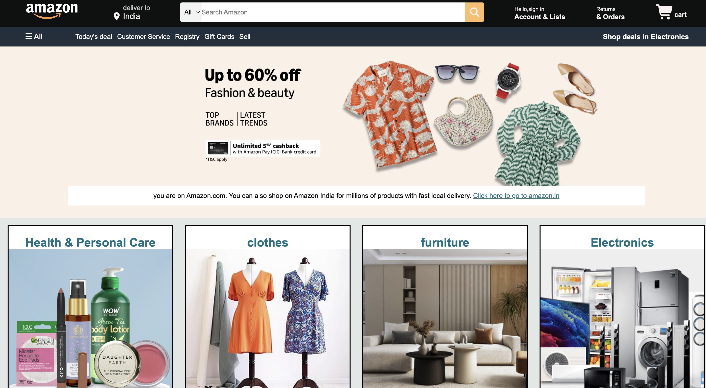
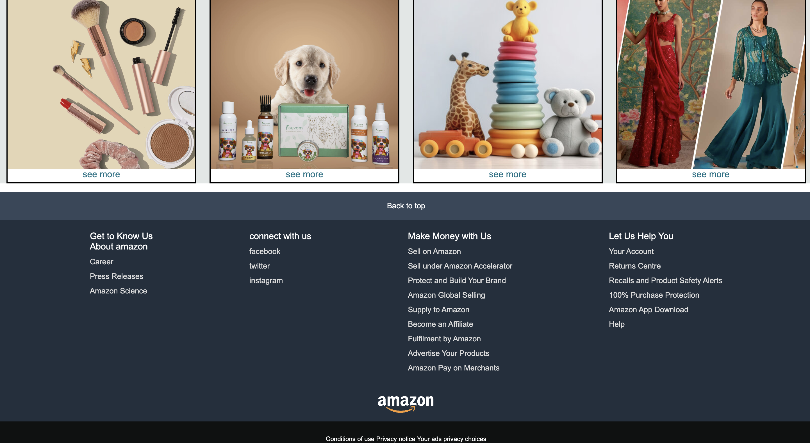

# 🛒 Amazon Clone

### This is a simple Amazon Clone Homepage built using HTML & CSS  
### It replicates the design of Amazon's landing page

#### 📌 Features
- Amazon-like navigation bar  
- banner image & promotional message  
- Product grid layout(Health, Clothes, Electronics, Furniture ...etc)  
- Footer section  

#### 🛠️ Tech Stack
- HTML
- CSS3
- Font Awesome(for icons)

## 🔗 Live Demo of project 
[View Project](https://clonehomepageamazon.netlify.app/) 🚀

### 📸 Screenshot of the project

  
  

